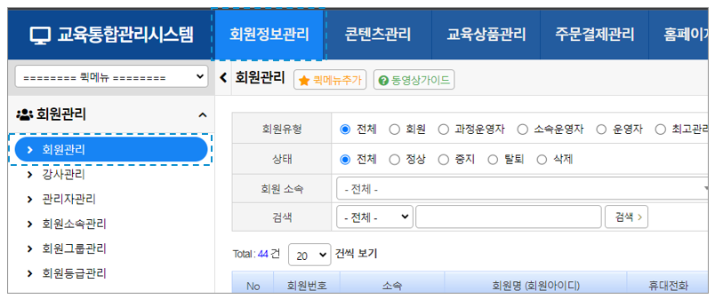

# 회원관리

사이트에 가입된 회원을 조회·등록·수정하고 상태를 관리합니다.

***

## 목차

1. [회원 목록 / 검색](#1-회원-목록--검색)
2. [개별 등록](#2-개별-등록)
3. [일괄 등록 (엑셀)](#3-일괄-등록-엑셀)
4. [일괄 갱신 (엑셀)](#4-일괄-갱신-엑셀)
5. [강사관리](#5-강사관리)
6. [관리자관리](#6-관리자관리)
7. [회원소속관리](#7-회원소속관리)
8. [회원그룹관리](#8-회원그룹관리)
9. [회원등급관리](#9-회원등급관리)
10. [탈퇴회원관리](#10-탈퇴회원관리)
11. [CRM](#11-crm)
12. [접속이력관리](#12-접속이력관리)
13. [개인정보 조회기록](#13-개인정보-조회기록)
14. [마케팅정보 수신동의관리](#14-마케팅정보-수신동의관리)

***

## 1. 회원 목록 / 검색

다양한 조건으로 회원을 필터링하고, 검색 결과에서 상태변경·발송·다운로드를 바로 실행할 수 있습니다.

### 검색 조건

| 항목 | 선택값 |
|---|---|
| **회원유형** | 전체 / 회원(U) / 과정운영자 / 소속운영자 / 운영자 / 최고관리자 |
| **상태** | 전체 / 정상(1) / 중지(0) / 탈퇴(-2) / 삭제(-1) |
| **가입일** | 시작일 ~ 종료일 범위 지정 (비워두면 전체 기간 조회) |
| **회원 소속** | 소속 트리에서 선택, 하위 소속 포함 검색. `[미소속]` 선택 시 소속 미배정 회원만 조회 |
| **회원 등급** | 등급관리에서 설정한 등급별 필터링 |
| **키워드** | 회원번호 / 아이디 / 이름 / 이메일 / 기타필드 / 휴대전화 (2자 이상 입력) |

### 목록 버튼

| 버튼 | 기능 | 비고 |
|---|---|---|
| **상태변경** | 선택한 회원의 상태 일괄 변경 | 운영자 이상 권한 필요 |
| **소속변경** | 선택한 회원의 소속 일괄 변경 | |
| **메일 / SMS / 쪽지** | 선택한 회원에게 발송 팝업 | SMS는 부가서비스 별도 신청 |
| **EXCEL** | 현재 검색 결과 전체 다운로드 | 개인정보 조회이력 자동 기록 |
| **일괄갱신** | 엑셀로 다수 회원 정보 일괄 수정 | |
| **일괄등록** | 엑셀로 다수 회원 일괄 등록 | |
| **등록** | 개별 회원 등록 페이지 이동 | |

### 행 클릭 동작

| 클릭 항목 | 동작 |
|---|---|
| **회원명** | CRM 창 팝업 (수강·주문·발송 등 종합 조회) |
| **휴대전화** | SMS 발송 창 팝업 |
| **이메일** | 메일 발송 창 팝업 |
| **수강 건수** | 통합수강생관리 페이지로 이동 |
| **실결제금액** | 해당 회원의 주문목록 페이지로 이동 |

***

## 2. 개별 등록

관리자가 직접 1명씩 회원을 등록합니다.

### 입력 필드

| 필드 | 필수 | 설명 |
|---|:---:|---|
| **회원아이디** | ✅ | 소문자 저장, 사이트 내 중복 불가 |
| **비밀번호** | ✅ | 영문 + 숫자 + 특수문자 조합 **8자 이상** |
| **회원명** | ✅ | |
| **소속** | ✅ | 회원소속관리에서 생성된 소속 목록 |
| **이메일** | | 형식 검증 적용 |
| **휴대전화** | | AES 암호화 저장 |
| **생년월일 / 성별** | | 사이트 설정에 따라 표시 여부 상이 |
| **주소** | | 우편번호 / 주소 / 상세주소 |
| **기타필드 1~5** | | 사이트별 커스텀 항목 (사이트설정에서 필드명 지정) |
| **상태** | ✅ | 정상(로그인 가능) / 중지(로그인 불가) |


비밀번호는 **영문·숫자·특수문자 조합 8자 이상**이어야 합니다.\
조건 미충족 시 등록이 차단됩니다.


### 등록 절차

1. 회원 목록 우측 상단 **\[등록]** 버튼 클릭
2. 필수항목(`*`) 포함 회원 정보 입력
3. 상태 선택 — 정상 또는 중지
4. **\[등록]** 클릭 → 완료 후 목록으로 자동 이동

***

## 3. 일괄 등록 (엑셀)

엑셀 파일(.xls)을 작성하여 다수의 회원을 한 번에 등록합니다.

### 엑셀 컬럼 구성

| 구분 | 컬럼 |
|---|---|
| **필수** | 아이디, 성명, 비밀번호 |
| **선택** | 이메일, 휴대전화, 생년월일, 성별, 소속 아이디, 우편번호, 주소, 상세주소, 기타1~5, 이메일수신동의(Y/N), SMS수신동의(Y/N) |


**소속 아이디**는 회원관리 → 회원소속관리에서 확인할 수 있습니다.\
**고객사 소속코드 사용** 체크 시, 이전 사이트의 소속코드로 연동 등록됩니다.


### 등록 절차

1. **\[일괄등록]** 버튼 클릭
2. **\[샘플양식 다운로드]** → 양식에 맞게 내용 작성
3. 등록할 **회원소속** 선택 (엑셀에 소속 아이디 미기재 시 선택한 소속으로 등록)
4. **\[파일선택]** → 작성한 엑셀 파일 업로드
5. **\[미리보기]** 로 등록될 회원 목록 사전 확인
6. **\[등록하기]** 클릭 → 완료

***

## 4. 일괄 갱신 (엑셀)


**아이디 / 회원아이디 / 성명**은 갱신 대상에서 제외됩니다. 변경할 수 없습니다.


### 갱신 절차

1. **\[일괄갱신]** 버튼 클릭
2. 갱신 대상 **회원소속** 선택
3. **\[샘플양식 다운로드]** → 해당 소속 회원 정보 수정 후 저장
4. **\[파일선택]** → 수정한 파일 업로드
5. **데이터 검증 결과** 확인 — 부적합 데이터 유무 확인
6. 이상 없으면 **\[일괄등록]** 클릭 / 오류 시 **\[초기화]** 후 재업로드

***

## 5. 강사관리

강사 정보를 등록·수정하고 사용자단 강사 목록 페이지 노출 여부를 관리합니다.


강사 등록은 **단순 노출 기능**입니다.\
과정 운영을 담당시키려면 별도로 **과정 운영자**로 등록해야 합니다.


### 강사 검색

| 번호 | 항목 | 설명 |
|:---:|---|---|
| ① | **검색** | 회원 소속 / 상태 / 검색 키워드 입력 후 **\[검색]** 클릭 |
| ② | **컬럼 정렬** | 클릭 시 오름차순/내림차순 (No / 휴대전화 제외) |
| ③ | **메일 / SMS / 쪽지** | 강사 선택 후 발송 — **EXCEL** : 강사 목록 다운로드 |
| ④ | **순서관리** | 순서자동입력 / 순서저장 |
| ⑤ | **메인노출** | 활성화 시 홈페이지 강사 진열 모듈에 노출 |


홈페이지관리 > 디자인관리 > 메인화면관리에서 **강사 진열 모듈**이 등록된 경우에만 표시됩니다.


### 강사 등록

| 번호 | 항목 | 설명 |
|:---:|---|---|
| ① | | **\[등록]** 버튼 클릭 |
| ② | **회원 정보** | 필수항목(`*`) 반드시 기재 |
| ③ | **강사소개 / 경력** | 강사소개, 경력사항 기재 (은행·계좌정보 제외) |
| ④ | **노출** | 체크 시 홈페이지 강사 목록에 노출 |
| ⑤ | **홍보문구** | 사용자단 강사목록 페이지 노출 문구 |
| ⑥ | **이미지** | 프로필 이미지 업로드 (권장: 400 × 400px) |
| ⑦ | **상태** | 정상 / 중지 선택 후 **\[등록]** 클릭 |

***

## 6. 관리자관리

운영자 계정을 등록하고 메뉴 접근 권한을 부여합니다.

### 관리자 유형

| 유형 | 권한 범위 |
|---|---|
| **과정 운영자** | 지정된 과정만 운영 (과정 개설 불가). 설계·평가·강의·과제 등 운영 담당 |
| **소속 운영자** | 소속 수강생에 대한 제한적 관리 권한 (모니터링·독려) |
| **운영자** | 최고관리자가 지정한 메뉴에 대한 모든 관리 권한 |
| **최고 관리자** | 모든 메뉴 권한 보유 / 자신의 메뉴권한 설정 불가 |


메뉴권한 설정 경로: 관리자관리 > **\[메뉴권한]** > 메뉴권한설정 > **\[저장]**


### 관리자 등록 및 관리

| 번호 | 항목 | 설명 |
|:---:|---|---|
| ① | **검색** | 소속 / 상태 / 키워드 입력 후 **\[검색]** |
| ② | **발송** | 메일 / SMS 발송 (SMS 별도 신청, 쪽지 불가) |
| ③ | **등록** | **\[등록]** 버튼으로 관리자 등록 |
| ④ | **아이디 클릭** | CRM 창 팝업 |
| ⑤ | **메뉴권한** | **\[메뉴권한]** 클릭 → 메뉴 접근 권한 설정 |

### 과정 운영자 설정

1. 교육상품관리 → 과정개설
2. 담당할 **\[과정]** 클릭
3. **\[과정정보]** 탭 → **\[운영정보]**
4. **\[과정 담당자 추가]** 클릭 후 운영자 선택 → **\[수정]**

### 소속 운영자 설정

1. 회원정보관리 → 회원소속관리
2. 관리할 **\[회원소속]** 클릭
3. 소속관리자 추가 또는 삭제 (관리자 소속 변경 필요)
4. **\[수정]** 클릭

***

## 7. 회원소속관리

회원 소속을 생성하고 관리합니다.\
소속 아이디는 일괄등록 엑셀 양식에서 소속 구분에 사용합니다.

| 항목 | 설명 |
|---|---|
| **소속명** | 소속 이름 (사용자단 미노출) |
| **소속 설명** | 소속 설명 (사용자단 미노출) |
| **소속 코드** | 회사 소속코드 입력 시 회원소속 등록에 활용 |
| **노출 여부** | 숨김 설정 시 회원가입·정보수정 화면에서 미노출 |

***

## 8. 회원그룹관리

그룹 단위로 수강 제한, 이메일 발송, 그룹할인 등을 적용합니다.

### 그룹 등록

| 번호 | 항목 | 설명 |
|:---:|---|---|
| ① | | **\[등록]** 버튼 클릭 |
| ② | **그룹명 / 그룹 설명** | 사용자단 미노출 |
| | **그룹 할인율** | 결제 시 해당 비율 할인 적용 (다수 그룹 소속 시 높은 할인율 자동 적용) |
| | **정기구독상품** | 해당 구독상품 구독자 그룹 생성 (정기구독 사용 시에만 노출) |
| ③ | | **\[등록]** 클릭하여 완료 |

### 그룹 구성원 수정

| 번호 | 설명 |
|:---:|---|
| ① | **\[그룹명]** 클릭 |
| ② | 포함할 소속 선택 |
| ③ | **\[포함 회원 선택]** : 소속 외 회원 추가 등록 |
| | **\[제외 회원 선택]** : 그룹핑에서 제외할 회원 등록 |
| ④ | **\[수정]** 클릭하여 완료 |

***

## 9. 회원등급관리

등급별 포인트 기준과 할인율을 설정합니다.

| 항목 | 설명 |
|---|---|
| **등급명** | 사용할 등급 이름 |
| **누적포인트구간** | 해당 등급 진입 기준 포인트 |
| **등급할인율** | 해당 등급 회원에게 적용되는 할인율 |
| **사용여부** | 정상 / 중지 |


포인트 정책 설정은 **홈페이지관리 > 포인트관리 > 포인트 정책 설정**에서 관리합니다.


***

## 10. 탈퇴회원관리

탈퇴 신청한 회원을 처리하거나 복구합니다.

### 회원 상태 구분

| 상태 | DB 값 | 설명 |
|---|:---:|---|
| **탈퇴** | `-2` | 탈퇴 신청 완료 — 복구 가능 |
| **삭제** | `-1` | 개인정보 삭제 완료 — 복구 불가 |

### 처리 기능

| 기능 | 동작 | 주의사항 |
|---|---|---|
| **복구** | 탈퇴(-2)를 정상(1)으로 복구 | 개인정보 삭제(-1) 후에는 복구 불가 |
| **개인정보삭제** | 이름·연락처 등 삭제, 탈퇴 기록 유지 | 완전삭제 전 선행 필수 |
| **완전삭제** | 회원 정보·탈퇴 기록 모두 영구 삭제 | 복구 불가, 동일 아이디 재가입 가능 |


**완전삭제는 되돌릴 수 없습니다.**\
동일 아이디로 재가입 요청 시 → **개인정보삭제 → 완전삭제** 순서로 진행해야 합니다.


***

## 11. CRM

회원 목록에서 **\[회원명]** 클릭 시 해당 회원의 종합 정보를 팝업으로 확인하고 관리합니다.

| 탭 | 주요 기능 |
|---|---|
| **수강정보** | 수강중/종료 탭, 진도율 확인, 완료처리, 학습기간 수정 |
| **회원정보** | 가입 기재사항 조회 및 비밀번호 변경 |
| **회원이력** | 과정학습 / 방송시청 / 다운로드 / 접속 이력 |
| **주문** | 교육과정 및 상품 주문내역 |
| **쿠폰 / 포인트** | 보유 쿠폰·프리패스 및 포인트 사용내역 |
| **Q\&A** | 게시판 Q\&A / 과정 Q\&A |
| **발송** | 메일 / SMS / 쪽지 발송내역 |

### 수강정보 탭

| 번호 | 설명 |
|:---:|---|
| ① | 개별입과 처리 시 등록 과정 선택 |
| ② | **\[수강중 / 종료]** 탭에서 수강 현황 확인 |
| ③ | 과정명 클릭 → 해당 과정 상세정보 확인 |
| ④ | **\[진도 로그]** 클릭 → 과정학습 진도 이력 조회 |
| ⑤ | 학습기간 개별 수정 및 변경 이력 확인 |
| ⑥ | 수강현황 컬럼 — 아래 표 참고 |

**수강현황 컬럼 안내**

| 컬럼 | 설명 |
|---|---|
| **강의(초)** | 콘텐츠 총 시간 (영상의 길이) |
| **인정(초)** | 과정 등록 시 설정한 인정 시간 |
| **학습(초)** | 수강생이 실제로 수강한 시간 |
| **진도율** | 학습시간 + 최대위치의 합이 인정시간 초과 시 100% |
| **완료처리** | **\[완료처리]** 버튼으로 수동 처리 |
| **전체완료처리** | 해당 과정 내 모든 강의 한 번에 완료 처리 |

### 회원정보 탭

| 번호 | 설명 |
|:---:|---|
| ① | **회원등급** : 설정된 등급 및 누적포인트 확인 |
| ② | 회원 상태 변경 (정상 / 중지 / 탈퇴) |
| ③ | **\[수정]** 버튼 클릭하여 저장 |


탈퇴 처리된 회원은 **\[회원관리] > \[탈퇴회원관리]**에서 관리합니다.\
상담이력 등록 후 수정·삭제 불가, 숨김 처리만 가능합니다.


***

## 12. 접속이력관리

관리자단 및 사용자단 로그인 접속 기록을 조회합니다.

| 번호 | 항목 | 설명 |
|:---:|---|---|
| ① | **로그기록** | 날짜 직접 선택 또는 **\[금일] / \[금주] / \[금월]** 자동 설정 |
| | **접속단** | 사용자단 / 관리자단 |
| | **구분** | 로그인 / 로그아웃 / 세션만료 / 자동로그인 |
| ② | **접속 기록** | 목록 확인 |
| ③ | **EXCEL** | **\[EXCEL]** 버튼으로 접속기록 내역 다운로드 |

***

## 13. 개인정보 조회기록

관리자의 개인정보 조회 이력을 확인합니다.

| 번호 | 항목 | 설명 |
|:---:|---|---|
| ① | **유형** | 전체 / 동의 / 목록 / 조회 / 엑셀 / 등록 / 갱신 |
| | **구분** | 관리자단 / 교강사단 |
| ② | **조회 기록** | 목록 확인 |
| ③ | **EXCEL** | **\[EXCEL]** 버튼으로 조회기록 내역 다운로드 |

***

## 14. 마케팅정보 수신동의관리

광고성 정보 수신 동의 여부를 확인하고 수신동의 안내 메일을 발송합니다.

| 번호 | 설명 |
|:---:|---|
| ① | **\[회원아이디]** 클릭 → CRM 창으로 이동 |
| ② | 이메일 / SMS 수신동의 여부 확인 |
| ③ | 수신동의 안내할 회원 선택 후 **\[수신동의안내발송]** 클릭 |
| ④ | **\[EXCEL]** : 수신동의 내역 다운로드 |


수신동의여부 변경은 **사용자단 > 마이페이지 > 개인정보변경**에서만 가능합니다.

